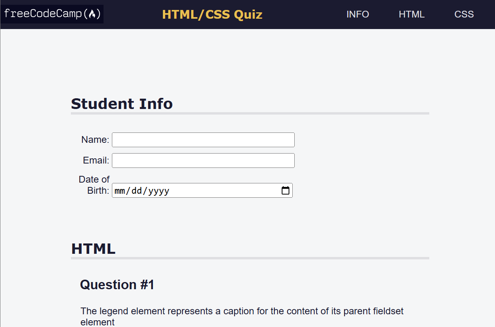

## accessibility-focused-quiz

A quiz on HTML and CSS, with a learning focus on how to incorporate accesbility features within a webpage.

**Live-Demo:** [https://oendemann.github.io/accessibility-focused-quiz/]

---

---

## About The Project

FreeCodeCamp web design course project that focuses on accessibility features within CSS and HTML. Compared to previous projects, this project had a stronger focus on independent design choices and less obvious instructions.

---

## Built With

* **HTML:** Used for the structure and organization of webpage (e.g. nesting inputs inside labels inside sections, etc).
* **CSS:** Used to refine the look of webpage (indentation, coloring, etc).

---

## What I Learned

1. CSS selectors can be setup in various ways (e.g. "footer a" vs "footer > a", etc).
2. CSS can be used to control how more than I imagined at first (e.g. how a mouse reacts when hovering over a link, etc).
3. I've found that it may be helpful to id most variables in some way (whether that be with "id=" or "class=") for easier fine-tuning when nesting becomes more expansive.

---

## Acknowledgments

* Project idea and requirements from [freeCodeCamp.org](https://www.freecodecamp.org/)